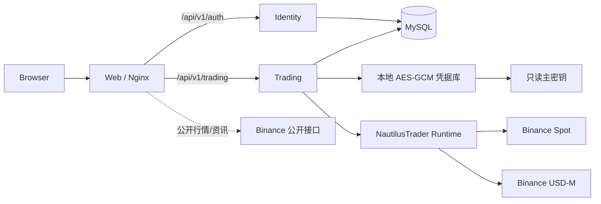

# Quant Desk 技术方案总览

> 文档编号：QT-ARCH-001
>
> 版本：1.0
>
> 日期：2026-09-21
>
> 状态：阶段一已上线（ECS 生产环境）

本文整理系统当前的整体技术方案，覆盖架构、模块职责、技术栈、数据与接口、
安全、部署与演进路线。分模块细节以各专项文档为准，发生冲突时以
[单账号分阶段设计](plans/2026-09-21-binance-single-account-phased-design.md)
为权威。

## 1. 系统定位

面向单用户的币安账户查询与人工交易系统。阶段一只提供只读查询（API 权限、
现货余额、U 本位余额与持仓）；人工下单、撤单、杠杆与保证金模式属阶段二，
生产写入默认关闭。

设计取向：模块化单体、极简依赖，不引入 A 股行情、风控审计、多账号管理、
Kafka/Redis/MinIO 等中间件。

## 2. 总体架构



运行组件仅五个：Web、Identity、Trading、MySQL，以及 Trading 进程内的
NautilusTrader Runtime。首页行情与资讯由浏览器直连币安公开接口，不经后端。

## 3. 模块职责

| 模块 | 目录 | 职责 |
| --- | --- | --- |
| Web | `apps/web` | 首页、策略、交易、登录与用户信息 |
| Identity | `services/identity-tenant` | 邮箱密码认证、JWT、刷新令牌、TOTP MFA |
| Trading | `services/trading` | 单币安账号、凭据加密、Nautilus 只读概览 |
| 部署编排 | `infra/compose` | MySQL 与三个应用服务的单机 Compose |

### 3.1 Web

一级导航为首页、策略、交易三项，右侧保留系统状态、用户邮箱、设置与退出。
前端结构详见
[Web 前端三页全流程设计](frontend/2026-09-21-web-three-page-design.md)。

```text
apps/web/src/app          # AppShell 顶部导航与路由
apps/web/src/pages        # HomePage / StrategiesPage / TradingPage / 登录 / 用户
apps/web/src/features/auth      # 认证上下文与登录、MFA
apps/web/src/features/market    # 币安公开行情/资讯取数
apps/web/src/features/trading   # 账户概览、绑定对话框、总资产面板
apps/web/src/styles       # 设计令牌与页面样式
```

- 首页：行情与资讯走币安公开接口，每 1 秒主动静默刷新。
- 策略：研究执行看板，阶段一为静态数据。
- 交易：总资产读取真实概览并复用绑定流程；当前订单为阶段二占位。

### 3.2 Identity

邮箱作为唯一身份标识，界面不要求用户 ID 或租户 ID；服务内部为每个邮箱创建
隔离空间并写入 JWT，供 Trading 做数据隔离。

### 3.3 Trading

单币安 HMAC 账号：绑定、重新绑定（先验证候选、成功后覆盖、失败保留旧账号）、
删除。凭据仅以 AES-256-GCM 密文保存，主密钥只读挂载。进程内运行一个只读
NautilusTrader Runtime，聚合 Spot 与 USD-M 概览并支持局部降级。

## 4. 技术栈

| 层 | 技术 |
| --- | --- |
| 前端 | React 19、TypeScript 5.9、Vite 7、React Router 7、Vitest 3、lucide-react |
| 后端 | Python 3.12、FastAPI、SQLAlchemy 2、Alembic、pytest |
| 交易引擎 | NautilusTrader 1.231.0（Spot 与 USD-M 双客户端） |
| 数据库 | MySQL 8.4（本地开发可用 SQLite） |
| 部署 | Docker Compose、Nginx（unprivileged）静态托管 |
| 工程化 | uv、pnpm workspace、ruff、mypy、prettier、markdownlint |

## 5. 接口

### 5.1 Identity

```text
POST /api/v1/auth/register
POST /api/v1/auth/login
POST /api/v1/auth/refresh
POST /api/v1/auth/logout
POST /api/v1/auth/mfa/totp/enroll
POST /api/v1/auth/mfa/totp/verify
GET  /health/live
GET  /health/ready
```

### 5.2 Trading（阶段一）

```text
GET    /api/v1/trading/binance/account
PUT    /api/v1/trading/binance/account
DELETE /api/v1/trading/binance/account
GET    /api/v1/trading/binance/overview
GET    /health/binance
```

`overview` 返回账号摘要与 Key 指纹、API 权限、非零现货余额、U 本位余额与非零
持仓；普通请求复用最多 5 秒内存快照，`refresh=true` 强制刷新，Spot 与 USD-M
单侧失败时另一侧仍返回。阶段二接口（订单、杠杆、保证金模式）见分阶段设计。

### 5.3 币安公开接口（浏览器直连）

```text
GET https://data-api.binance.vision/api/v3/ticker/24hr    # 现价与 24h 涨跌
GET https://data-api.binance.vision/api/v3/klines          # 迷你走势
GET https://www.binance.com/bapi/composite/v1/public/cms/article/list/query  # 公告
```

均返回 `access-control-allow-origin: *`，无需 API Key。

## 6. 数据与运行时

- MySQL 承载 Identity 与 Trading 两个逻辑库；本地开发默认使用 SQLite。
- Trading 迁移当前至 `0004_single_binance_account`，强制每租户一个币安账号槽位。
- 币安凭据以 AES-256-GCM 密文存储，主密钥为 32 字节原始随机数、宿主权限
  `600`、只读挂载，容器内属主为 `100:101`。

## 7. 安全

- 认证：JWT 短期访问令牌 + 刷新令牌轮换；写入操作（阶段二）额外要求短时
  MFA 会话与幂等键。
- 凭据：仅返回 Key 指纹，绝不返回密钥或密文；密钥不进入 Git、镜像、环境变量
  或日志。
- 网络：Trading 端口仅绑定本地或内网，公网入口使用可信 HTTPS，币安 Key 绑定
  固定出口 IP，并关闭提现与划转权限。
- 生产写入门禁：`LIVE_TRADING_ENABLED` 默认 `false`。

## 8. 本地开发

```bash
uv sync --all-packages
pnpm install
```

服务默认端口与代理：

| 服务 | 端口 | 说明 |
| --- | --- | --- |
| Web (Vite) | 8080 | 代理 `/api/v1/auth`→8001、`/api/v1/trading`→8004 |
| Identity | 8001 | uvicorn |
| Trading | 8004 | uvicorn |

质量门禁：

```bash
make lint
make test
make build
```

## 9. 部署

```bash
bash scripts/deploy.sh init
bash scripts/deploy.sh up      # build + migrate + up -d --remove-orphans
bash scripts/deploy.sh status
```

仅前端改动时可只重建 Web 镜像并 `up -d --no-deps web`，其余服务不停机。部署
前置（主密钥、固定出口 IP、可信 HTTPS）与排障见
[Binance 运维手册](operations/binance-nautilustrader-runbook.md)。

## 10. 演进路线

- **阶段一（已上线）**：单账号只读查询、聚合概览与局部降级、生产只读部署。
- **阶段二（未开始）**：人工市价/限价单、单笔撤单、USD-M 杠杆与保证金模式，
  受功能开关、MFA 会话与幂等键保护，须先在 Testnet 完成生命周期与故障演练。

当前外部阻塞：ECS 到币安签名接口出口不可达、公网入口证书链待可信、缺专用
只读 Key，解决前不进入阶段二。详见
[生产准入状态](integrations/binance-production-readiness.md)。
