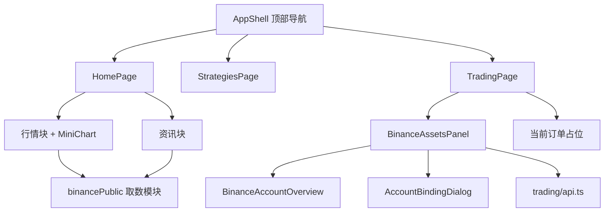

# Web 前端三页全流程设计

> 文档编号：QT-FE-DESK-001
>
> 版本：1.0
>
> 日期：2026-09-21
>
> 状态：已上线（ECS 生产环境）

本文覆盖 Web 前端首页、策略、交易三个一级页面的需求、方案、技术实现、数据
接口、测试与验收，贯穿从需求到部署的完整环节。后端币安单账号契约以
[单账号分阶段设计](../plans/2026-09-21-binance-single-account-phased-design.md)
为准，发生冲突时以后端设计文档为权威。

## 1. 需求

### 1.1 一级导航

顶部导航固定为三项，右侧保留系统状态、用户邮箱、设置与退出：

```text
首页 · 策略 · 交易
```

### 1.2 首页

首页聚合两块内容，均使用币安公开数据，无需登录币安账号：

- **行情**：展示币安现货主要交易对的现价、24 小时涨跌幅与迷你走势图。
- **资讯**：展示币安官方公告列表，可跳转原文。
- 页面信息每 1 秒主动静默刷新一次。

### 1.3 策略

按研究与执行看板呈现，阶段一为静态展示：

- 顶部四张统计卡：策略总数、运行中、本月模型调用、预算使用。
- 「全部策略」表格：名称/版本、状态、标的池、环境、累计收益、最近运行、操作。
- 提供「创建策略」入口与「搜索策略」输入框。

### 1.4 交易

交易页聚合两块内容：

- **总资产**：读取真实币安账户概览（现货、U 本位余额与持仓）；未绑定时展示
  绑定入口，支持重新绑定与删除。
- **当前订单**：下单与撤单能力属阶段二，阶段一展示只读占位与说明。

## 2. 方案

### 2.1 页面与数据来源

| 页面 | 区块 | 数据来源 | 是否需登录币安账号 |
| --- | --- | --- | --- |
| 首页 | 行情 | 币安公开行情接口 | 否 |
| 首页 | 资讯 | 币安公告 CMS | 否 |
| 策略 | 统计卡 / 表格 | 前端静态数据 | 否 |
| 交易 | 总资产 | Trading `GET /overview` | 是 |
| 交易 | 当前订单 | 阶段二开放 | 是 |

### 2.2 组件结构



交易页复用既有的账户概览与绑定组件；首页行情与资讯统一由取数模块
`features/market/binancePublic.ts` 提供数据。

### 2.3 视觉约定

沿用交易终端式高密度布局：顶部菜单导航、细线分隔、4px 小圆角、无阴影、浅色
纯文字导航。

## 3. 技术实现

### 3.1 关键文件

```text
apps/web/src/app/AppShell.tsx                     # 顶部三项导航与路由
apps/web/src/pages/HomePage.tsx                   # 首页：行情 + 资讯
apps/web/src/pages/StrategiesPage.tsx             # 策略看板（静态）
apps/web/src/pages/TradingPage.tsx                # 交易：总资产 + 当前订单
apps/web/src/features/market/binancePublic.ts     # 币安公开数据取数
apps/web/src/features/trading/BinanceAssetsPanel.tsx  # 总资产面板（含绑定流程）
apps/web/src/styles/tokens.css                    # 页面样式类
```

### 3.2 首页自动刷新

首次进入展示加载态，其后每 1 秒静默刷新行情与资讯。静默刷新不重置为加载态，
且在瞬时失败时保留已有数据，避免界面闪烁：

```text
进入页面 -> 首次加载（显示加载态）
         -> setInterval 每 1000ms 静默刷新（loadMarket(true) / loadNews(true)）
         -> 组件卸载时 clearInterval
```

手动点击「刷新」按钮为非静默加载，显示加载指示。

### 3.3 行情走势归一化

行情走势图取近 24 小时 1 小时 K 线的收盘价，映射到 `150 x 42` 视图坐标，y 轴
翻转使高价位于上方。

## 4. 数据接口

### 4.1 币安公开数据（浏览器直连）

两个接口均返回 `access-control-allow-origin: *`，浏览器可直连，无需 API Key。

```text
# 行情：现价与 24 小时涨跌幅
GET https://data-api.binance.vision/api/v3/ticker/24hr?symbols=[...]

# 行情：迷你走势（近 24 根 1 小时 K 线）
GET https://data-api.binance.vision/api/v3/klines?symbol=<SYMBOL>&interval=1h&limit=24

# 资讯：币安官方公告
GET https://www.binance.com/bapi/composite/v1/public/cms/article/list/query?type=1&catalogId=48&pageNo=1&pageSize=<N>
```

默认展示的现货交易对：`BTCUSDT`、`ETHUSDT`、`BNBUSDT`、`SOLUSDT`。公告标题
跳转地址为 `https://www.binance.com/en/support/announcement/<code>`。

### 4.2 交易账户概览（需登录）

交易页总资产复用 Trading 服务既有契约：

```text
GET /api/v1/trading/binance/overview
```

未绑定账号时返回 `binance.account_missing`，前端据此展示绑定入口而非报错。

## 5. 测试

前端使用 Vitest，覆盖导航、页面关键区块与取数逻辑：

```text
apps/web/src/app/AppShell.test.tsx                    # 三项导航与各页渲染
apps/web/src/pages/HomePage.test.tsx                  # 行情/资讯渲染、错误态、1 秒刷新
apps/web/src/features/market/binancePublic.test.ts    # 取数归一化与错误处理
```

回归命令：

```bash
pnpm --filter web lint
pnpm --filter web test
pnpm --filter web build
```

## 6. 验收

- 顶部导航为首页、策略、交易三项，右侧保留状态、邮箱、设置与退出。
- 首页行情与资讯展示币安真实公开数据，且每 1 秒自动刷新。
- 策略页四张统计卡与表格按看板规格呈现。
- 交易页总资产读取真实概览，未绑定时展示绑定入口；当前订单为阶段二占位。
- 1280×720 与移动端窄屏均无横向溢出。

## 7. 部署

前端随 Web 镜像发布。仅前端改动时可只重建 Web：

```bash
docker compose --env-file infra/compose/.env.deploy \
  -f infra/compose/docker-compose.yml build web
docker compose --env-file infra/compose/.env.deploy \
  -f infra/compose/docker-compose.yml up -d --no-deps web
```

2026-09-21 已发布到 ECS 生产环境，公网 HTTPS 入口验证首页行情/资讯、策略看板
与交易页均为最新版本。
