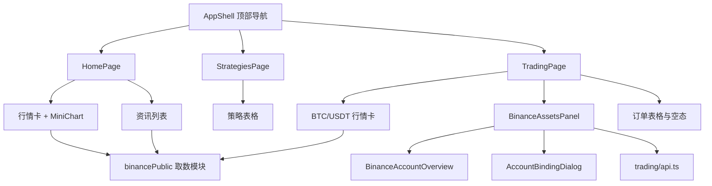

# Web 前端三页全流程设计

> 文档编号：QT-FE-DESK-001
>
> 版本：1.1
>
> 日期：2026-09-22
>
> 状态：当前实现

本文覆盖 Web 前端首页、策略、交易三个一级页面的需求、方案、技术实现、数据
接口、测试与验收，贯穿从需求到部署的完整环节。后端币安单账号契约以
[单账号分阶段设计](../plans/2026-09-21-binance-single-account-phased-design.md)
为准，发生冲突时以后端设计文档为权威。

## 1. 需求

### 1.1 一级导航

顶部导航固定为三项，右侧保留系统状态、用户邮箱、设置与退出：

```text
首页 · 策略 · 交易
```

### 1.2 首页

首页聚合两块内容，均使用币安公开数据，无需登录币安账号：

- **行情**：四张等高行情卡展示主要现货交易对的现价、24 小时涨跌幅与迷你
  走势图。
- **资讯**：以时间、类型、标题和外链组成的标准列表展示官方公告。
- 页面信息每 1 秒主动静默刷新一次。

### 1.3 策略

保留研究与执行列表结构，阶段一不展示虚构业务数据：

- 「策略」六列表格：名称/版本、状态、标的池、环境、累计收益、最近运行。
- 搜索和新增控件保留布局但明确禁用；标题、搜索框和操作按钮在窄屏下仍保持
  一行。
- 表格内部显示规划中空态。

### 1.4 交易

交易页聚合行情、资产和订单：

- **行情**：左栏复用首页行情卡，固定展示 BTC/USDT。
- **资产**：右栏读取真实账户概览（现货、U 本位余额与持仓）；未绑定时以
  USDT 摘要卡展示绑定入口，已绑定时支持刷新、重新绑定与删除。
- **订单**：与策略区使用相同的六列表格和工具栏；下单与撤单能力属阶段二，
  阶段一在表格内显示空态。
- 行情和资产始终保持左右两列；移动端隐藏迷你走势图，为主要信息留出空间。

## 2. 方案

### 2.1 页面与数据来源

| 页面 | 区块 | 数据来源 | 是否需登录 B 账号 |
| --- | --- | --- | --- |
| 首页 | 行情 | 币安公开行情接口 | 否 |
| 首页 | 资讯 | 币安公告 CMS | 否 |
| 策略 | 策略表格 | 阶段二开放 | 否 |
| 交易 | 行情 | 币安公开行情接口 | 否 |
| 交易 | 资产 | Trading `GET /overview` | 是 |
| 交易 | 订单 | 阶段二开放 | 是 |

### 2.2 组件结构



交易页复用既有的账户概览与绑定组件；首页行情与资讯统一由取数模块
`features/market/binancePublic.ts` 提供数据。

### 2.3 视觉约定

采用安静、紧凑的交易工作台风格：

- 内容最大宽度 `1240px`，桌面端使用 48px 页面留白，移动端收缩为 24px。
- 字体优先使用 Avenir Next 与苹方，文本不随视口宽度缩放。
- 灰白背景、白色内容面、绿色主操作、红色风险/下跌状态，避免单一色调。
- 卡片和输入控件使用 6px 圆角、细边框与轻阴影；弹窗使用 8px 圆角。
- 首页行情卡、交易页行情卡和未连接资产卡固定为 `164px` 高。
- 资讯使用列表，策略与订单使用统一表格；表格在窄屏下横向滚动。
- 策略/订单标题和工具栏不换行，搜索框可收缩但不挤出操作按钮。

所有用户可见的中文交易所名称统一显示为“B”。代码标识符、API 路径和外部 URL
中的 `binance` / `Binance` 不改名。

## 3. 技术实现

### 3.1 关键文件

```text
apps/web/src/app/AppShell.tsx                     # 顶部导航、路由与真实健康状态
apps/web/src/pages/HomePage.tsx                   # 首页：行情 + 资讯
apps/web/src/pages/StrategiesPage.tsx             # 策略表格与规划中空态
apps/web/src/pages/TradingPage.tsx                # 交易：行情 + 资产 + 订单
apps/web/src/features/market/binancePublic.ts     # 币安公开数据取数
apps/web/src/features/trading/BinanceAssetsPanel.tsx  # 资产面板（含绑定流程）
apps/web/src/styles/tokens.css                    # 页面样式类
```

### 3.2 实时数据自动刷新

首页行情、首页资讯和交易页 BTC/USDT 行情共用 `useLivePolling`。首次进入展示
加载态，其后每 1 秒静默刷新；静默刷新不重置为加载态，且在瞬时失败时保留已有
数据，避免界面闪烁：

```text
进入页面 -> 首次加载（显示加载态）
         -> setInterval 每 1000ms 静默刷新（load(true)）
         -> 组件卸载时 clearInterval
```

### 3.3 行情走势归一化

行情走势图取近 24 小时 1 小时 K 线的收盘价，映射到 `150 x 42` 视图坐标，y 轴
翻转使高价位于上方。

## 4. 数据接口

### 4.1 币安公开数据（浏览器直连）

以下公开接口可由浏览器直连，无需 API Key。

```text
# 行情：现价与 24 小时涨跌幅
GET https://data-api.binance.vision/api/v3/ticker/24hr?symbols=[...]

# 行情：迷你走势（近 24 根 1 小时 K 线）
GET https://data-api.binance.vision/api/v3/klines?symbol=<SYMBOL>&interval=1h&limit=24

# 资讯：币安官方公告
GET https://www.binance.com/bapi/composite/v1/public/cms/article/list/query?type=1&catalogId=48&pageNo=1&pageSize=<N>
```

默认展示的现货交易对：`BTCUSDT`、`ETHUSDT`、`BNBUSDT`、`SOLUSDT`。公告标题
跳转地址为 `https://www.binance.com/en/support/announcement/<code>`。

### 4.2 交易账户概览（需登录）

交易页资产复用 Trading 服务既有契约：

```text
GET /api/v1/trading/binance/overview
```

未绑定账号时返回 `binance.account_missing`，前端据此展示 USDT 未连接摘要卡和
绑定入口，而非报错。绑定、重新绑定和删除前先检查 5 分钟内的 MFA；缺失或过期
时打开身份验证对话框，验证成功后继续原操作。

## 5. 测试

前端使用 Vitest，覆盖导航、页面关键区块与取数逻辑：

```text
apps/web/src/app/AppShell.test.tsx                    # 三项导航与页面关键结构
apps/web/src/pages/HomePage.test.tsx                  # 行情/资讯、错误态、1 秒刷新
apps/web/src/features/market/binancePublic.test.ts    # 取数归一化与错误处理
apps/web/src/features/trading/*.test.tsx              # 绑定与账户概览
```

回归命令：

```bash
pnpm --filter web lint
pnpm --filter web test
pnpm --filter web build
```

## 6. 验收

- 顶部导航为首页、策略、交易三项，右侧保留状态、邮箱、设置与退出。
- 顶部状态轮询 `/api/v1/trading/health`，不展示伪造延迟或固定正常状态。
- 首页四张行情卡等高，资讯以列表展示，数据每 1 秒自动刷新。
- 策略页只保留六列表格与规划中空态；标题、搜索框和禁用的新增按钮始终处于
  同一行。
- 交易页行情在左、资产在右，移动端仍为双列；未绑定时展示 USDT 绑定入口。
- 订单区与策略区使用相同的工具栏和六列表格，阶段一空态位于表格内部。
- 阶段一新增订单按钮禁用，不提供无效点击。
- 用户可见文案不出现“币安”，统一显示为“B”。
- 1280×720 与 320px 起的移动端窄屏无页面级横向溢出；数据表允许区域内滚动。

## 7. 部署

前端随 Web 镜像发布。仅前端改动时可只重建 Web：

```bash
docker compose --env-file infra/compose/.env.deploy \
  -f infra/compose/docker-compose.yml build web
docker compose --env-file infra/compose/.env.deploy \
  -f infra/compose/docker-compose.yml up -d --no-deps web
```

2026-09-21 已发布阶段一基础版本。本文 1.1 版记录 2026-09-22 的最新界面实现；
推送代码不等同于生产发布，ECS 更新仍按运维手册执行。
