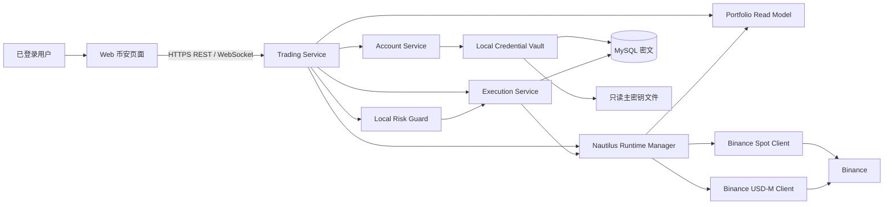
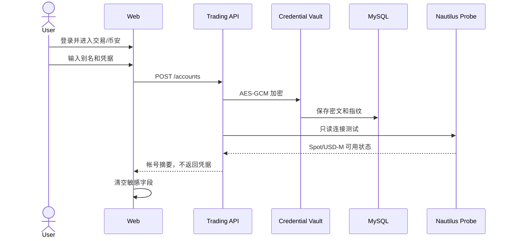

# 币安 NautilusTrader 接入设计

> 文档编号：QT-DES-BIN-NT-001
>
> 版本：1.0
>
> 日期：2026-09-20
>
> 状态：已确认

## 1. 决策摘要

币安接入改为 NautilusTrader 主导的单服务架构。系统支持：

- 登录后在“交易 → 币安”添加帐号。
- 保存多个币安帐号，但只运行一个活动帐号。
- 现货和 U 本位合约。
- U 本位杠杆倍数、全仓/逐仓保证金模式、单向/双向持仓。
- HMAC 和 Ed25519 凭据。

系统不再使用币安官方 SDK、自研币安 REST/WebSocket 客户端、云 KMS、独立
Risk Service、Kafka/Outbox 或单独的 Binance Connector。NautilusTrader 负责
交易所协议、市场数据、执行、私有流和执行状态对账；Trading Service 负责 Web
接口、帐号生命周期、本地凭据加密、业务风控和持久化。

## 2. 设计原则

1. **单一执行源**：所有币安订单只能通过 NautilusTrader 提交。
2. **单活动帐号**：避免多个 LiveNode 争用进程、缓存和客户端订单 ID。
3. **依赖能力优先**：不复制 Nautilus 已提供的签名、重连和对账逻辑。
4. **本地最小安全边界**：不引入 KMS 服务，但凭据必须加密入库。
5. **状态不猜测**：连接或订单结果不确定时暂停写入并等待对账。
6. **先人工后自动**：首轮仅人工交易，自动策略在稳定运行后单独评审。

## 3. 系统架构



Trading Service 保持 FastAPI 进程。Nautilus `LiveNode` 在应用生命周期内由
`RuntimeManager` 创建和销毁，不能在同一进程中并行运行多个节点。

活动帐号包含两个独立客户端：

- `BINANCE_SPOT`：现货行情和执行。
- `BINANCE_FUTURES`：U 本位行情、订单、持仓、杠杆及保证金模式。

## 4. 模块划分

### 4.1 `credentials`

- 从主密钥文件读取 32 字节密钥。
- 使用 AES-256-GCM 加密和解密帐号凭据。
- 每次加密生成独立 96-bit nonce。
- 将 `account_id`、凭据类型和版本作为附加认证数据。
- 返回脱敏 Key 指纹，不提供明文读取接口。

### 4.2 `accounts`

- 创建、更新、删除和列出币安帐号。
- 维护帐号状态：
  `draft -> validating -> ready -> activating -> active -> disabled|error`。
- 保证数据库中最多一个 `active` 帐号。
- 记录人工确认的 IP 白名单和禁止提现检查。

### 4.3 `binance_runtime`

- 创建 Nautilus `LiveNode`。
- 注册 Spot 和 USD-M Data/Execution Client。
- 加载所需 instruments。
- 将 Nautilus 事件投影到平台订单和账户视图。
- 暴露连接、同步、对账和停止状态。

低层 Binance HTTP/WebSocket 客户端属于 Nautilus 内部实现，业务代码不得直接
依赖其私有模块。

### 4.4 `execution`

- 将 API DTO 转换为 Nautilus Order。
- 生成稳定且可追踪的 Client Order ID。
- 持久化幂等键和请求指纹。
- 提交、撤单并消费订单/成交事件。
- 不在不确定结果下重新发送写命令。

### 4.5 `portfolio`

- 从 Nautilus Cache 读取余额、订单、成交和持仓。
- 维护 Web 所需的只读投影。
- 标记数据时间和新鲜度。
- 识别外部手工订单，不将其冒充平台订单。

### 4.6 `risk_guard`

同进程、同步、Fail Closed，只保留：

- 全局和帐号急停。
- 单笔最大名义金额。
- 单标的最大仓位。
- U 本位最大杠杆。
- 每日最大亏损。
- 数据过期和未完成对账阻断。

不保留独立 Risk Service、审批令牌和跨服务网络调用。

### 4.7 `repository`

使用现有 MySQL 保存：

- 帐号元数据和加密凭据。
- 当前活动帐号。
- 平台订单与 Nautilus/Binance ID 映射。
- 风控配置、急停状态和审计事件。

## 5. 帐号与凭据流程

### 5.1 添加帐号



连接测试不能作为提现权限的机器校验。由于不引入第二套 Binance 客户端，固定出口
IP、读取/交易权限和禁止提现由用户在币安控制台确认，系统保存确认人和确认时间。
该权衡仅适用于当前个人单机部署。

### 5.2 切换帐号

1. 获取全局帐号切换锁。
2. 设置 `trading_accepting=false`。
3. 等待当前命令进入明确状态或进入待对账状态。
4. 停止旧 LiveNode 并清除凭据引用。
5. 解密目标帐号凭据。
6. 创建 Spot 与 USD-M 客户端。
7. 完成账户、订单和持仓对账。
8. 原子更新 `active_account_id`。
9. 对账通过后恢复人工交易。

失败时保留目标帐号的错误状态，不自动启动旧帐号，避免操作者误判交易账户。

## 6. API 设计

所有路径均以 `/api/v1/trading/binance` 开头，要求登录；帐号变更和交易写操作
要求管理员权限及近期 MFA。

| 方法 | 路径 | 用途 |
| --- | --- | --- |
| GET | `/accounts` | 列出帐号摘要 |
| POST | `/accounts` | 添加并加密帐号 |
| PUT | `/accounts/{account_id}` | 替换凭据或别名 |
| DELETE | `/accounts/{account_id}` | 删除非活动帐号 |
| POST | `/accounts/{account_id}/test` | 只读连接测试 |
| POST | `/accounts/{account_id}/activate` | 切换活动帐号 |
| POST | `/accounts/active/deactivate` | 停止当前帐号 |
| GET | `/status` | 运行和对账状态 |
| GET | `/balances` | 当前帐号余额 |
| GET | `/positions` | U 本位持仓 |
| GET | `/orders` | 订单列表 |
| POST | `/orders` | 提交现货或 U 本位订单 |
| POST | `/orders/{order_id}/cancel` | 撤单 |
| PUT | `/futures/{symbol}/leverage` | 设置杠杆 |
| PUT | `/futures/{symbol}/margin-mode` | 设置保证金模式 |
| GET | `/risk` | 查询本地风控 |
| PUT | `/risk` | 修改本地风控 |
| POST | `/emergency-stop` | 开启急停 |
| DELETE | `/emergency-stop` | 解除急停 |

### 6.1 添加帐号

```json
{
  "alias": "main-binance",
  "credential_type": "hmac",
  "api_key": "write-only",
  "secret": "write-only",
  "ip_whitelist_confirmed": true,
  "withdrawal_disabled_confirmed": true
}
```

响应：

```json
{
  "id": "uuid",
  "alias": "main-binance",
  "credential_type": "hmac",
  "api_key_fingerprint": "sha256:abcd1234",
  "status": "ready",
  "spot_available": true,
  "usdm_futures_available": true,
  "active": false
}
```

### 6.2 下单

```json
{
  "product": "spot",
  "instrument_id": "BTCUSDT.BINANCE",
  "side": "buy",
  "order_type": "limit",
  "quantity": "0.001",
  "limit_price": "60000",
  "time_in_force": "GTC",
  "position_side": null,
  "reduce_only": false
}
```

`product=usdm_futures` 时 instrument 使用 Nautilus 永续命名，例如
`BTCUSDT-PERP.BINANCE`。

### 6.3 WebSocket

```text
GET /ws/trading/binance
```

消息类型：

- `connection.updated`
- `account.activated`
- `balance.updated`
- `order.updated`
- `execution.created`
- `position.updated`
- `risk.updated`
- `reconciliation.updated`

## 7. 数据模型

### 7.1 `binance_accounts`

```text
id, alias, credential_type, api_key_fingerprint,
credential_ciphertext, credential_nonce, credential_version,
status, is_active, spot_available, usdm_futures_available,
ip_whitelist_confirmed_at, withdrawal_disabled_confirmed_at,
last_tested_at, last_error_code, created_at, updated_at
```

约束：

- `alias` 唯一。
- 仅一条记录可为 `is_active=true`。
- 密文、nonce 和主密钥不得出现在 API。

### 7.2 `binance_runtime_state`

```text
account_id, spot_status, futures_status, reconciliation_status,
accepting_orders, last_event_at, last_reconciled_at, updated_at
```

### 7.3 `orders`

保留现有订单表，`account_scope` 收敛为 `spot|usdm_futures`。继续使用：

```text
id, account_id, client_order_id, broker_order_id, product,
instrument_id, side, position_side, order_type, time_in_force,
quantity, limit_price, reduce_only, status, idempotency_key,
request_fingerprint, submitted_at, updated_at
```

### 7.4 `risk_settings`

```text
account_id, emergency_stop, max_order_notional,
max_position_notional, max_futures_leverage, max_daily_loss,
updated_at
```

## 8. 依赖管理

首轮基线：

```toml
nautilus_trader = "==1.231.0"
cryptography = ">=46,<47"
fastapi = ">=0.116,<1"
sqlalchemy = ">=2.0,<3"
```

- 精确锁定 NautilusTrader，避免其适配器行为随升级变化。
- 使用现有 Python 3.12，当前 PyPI 包要求 `>=3.12,<3.15`。
- 删除币安自研客户端不再需要的直接 `httpx` 签名用途；若其他内部客户端仍使用
  `httpx`，则保留服务级依赖。
- 每次 Nautilus 升级必须检查 changelog、重新执行 Testnet 契约和恢复测试。
- 构建阶段必须验证目标 Linux/CPU 有可用 wheel，禁止生产现场源码编译。

## 9. 错误处理

| 场景 | 稳定错误码 | 行为 |
| --- | --- | --- |
| 主密钥缺失或权限错误 | `binance.credential_store_unavailable` | 帐号操作和交易关闭 |
| 凭据无法解密 | `binance.credential_invalid` | 帐号进入 error |
| Spot/USD-M 认证失败 | `binance.authentication_failed` | 不自动重试 |
| 网络或流断开 | `binance.disconnected` | 对应产品暂停新订单 |
| 状态过期 | `binance.state_stale` | 查询带 stale，写入拒绝 |
| 本地风控拒绝 | `binance.risk_rejected` | 不调用 Nautilus |
| 交易所明确拒绝 | `binance.order_rejected` | 保存拒绝原因 |
| 提交结果不确定 | `binance.pending_reconciliation` | 不重发，等待对账 |
| 帐号切换中 | `binance.account_switching` | 所有写请求返回 409 |
| 急停开启 | `binance.emergency_stopped` | 禁止新订单 |

服务重启、帐号切换和私有流恢复后必须先对账。Spot 与 USD-M 状态分别记录，
一侧故障仅冻结该产品的写操作。

## 10. 方案权衡

### 10.1 采用 NautilusTrader

收益：

- 删除自研签名、协议解析、WebSocket 保活和大部分订单恢复代码。
- 统一回测与实盘的订单、持仓和 instrument 模型。
- 直接获得 Spot 与 USD-M 的成熟适配。

代价：

- 引入较重的 Rust/Python 二进制依赖。
- 业务必须适配 Nautilus 事件循环和领域模型。
- 升级需要较严格的兼容回归。
- 低层客户端不是公共 Python API，不能依赖内部实现。

### 10.2 不使用币安官方 SDK

收益：

- 避免两个执行栈、双重重连和重复状态模型。
- 凭据只进入一个外部交易框架。

代价：

- 无法直接调用 Nautilus 未公开的 API Key restriction 端点。
- IP 白名单、提现权限等配置转为人工准入证据。

### 10.3 不使用 KMS

收益：

- 删除一个服务、云凭据、数据库和部署链路。
- 单机个人部署更容易恢复。

代价：

- 主密钥与应用位于同一主机，主机失陷时无法提供 KMS 级隔离。
- 主密钥备份、轮换和文件权限由运维负责。

## 11. 风险与控制

| 风险 | 控制 |
| --- | --- |
| Nautilus 版本回归 | 精确锁版、Testnet 契约、升级审批 |
| 单进程故障影响 API | 健康状态、自动重启、启动先对账 |
| 多帐号切换误操作 | 全局锁、禁止新订单、单活动帐号唯一约束 |
| 主密钥泄漏 | 600 权限、只读挂载、备份隔离、日志扫描 |
| 人工权限确认错误 | 双确认字段、部署清单、生产前截图证据 |
| 外部手工订单 | 对账纳管并标记来源 |
| 下单超时重复 | 幂等键、一次提交、等待 Nautilus 对账 |
| U 本位高杠杆 | 本地最大杠杆、最大名义价值和每日亏损限制 |
| 中国区网络不可达 | 上线前网络验收；失败时禁止绑定和交易 |

## 12. 迁移策略

1. 先增加 Nautilus 运行时和新表，不删除旧代码。
2. 使用 Testnet 完成 Spot 和 USD-M 只读验证。
3. 迁移帐号页面到新 API，并关闭旧 Scope 操作。
4. 在功能开关下完成 Testnet 下单和故障演练。
5. 删除自研 `trading/binance/client.py` 与 `signing.py`。
6. 从 Compose 移除 Binance 路径对 KMS Adapter、Risk Service 的依赖。
7. 迁移或重新录入帐号；旧 KMS 密文不自动解密迁移。
8. 完成生产灰度后删除旧 API、表字段和测试。

回滚仅允许回滚应用版本；新方案录入的凭据不能自动回滚到旧 KMS 方案。

## 13. 参考

- [NautilusTrader Binance integration](https://nautilustrader.io/docs/latest/integrations/binance/)
- [NautilusTrader live trading](https://nautilustrader.io/docs/latest/concepts/live/)
- [NautilusTrader execution reconciliation](https://nautilustrader.io/docs/latest/concepts/execution/reconciliation/)
