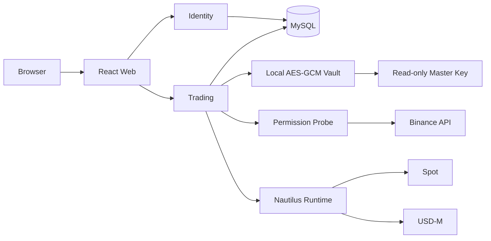

# Binance 单账号分阶段设计

> 状态：已确认
>
> 日期：2026-09-21

## 1. 目标

系统只服务一个产品方向：首位所有者登录后绑定唯一币安账号，查询 Spot 与 USD-M
账户数据，并在阶段二增加受 MFA 和幂等保护的人工交易。

核心原则：

- 生产环境仅允许首位所有者注册，全系统只有一个 Binance HMAC 账号。
- 重新绑定先验证候选账号，成功后覆盖，失败时保留旧账号。
- 凭据只以 AES-256-GCM 密文保存。
- Spot 与 USD-M 独立连接、独立报告故障。
- 阶段一没有可执行交易的业务接口。

## 2. 系统组成



运行组件只有 Web、Identity、Trading、MySQL 和 Trading 进程内的
NautilusTrader。

## 3. 账号与凭据

绑定表单只接受：

```text
alias
api_key
api_secret
ip_whitelist_confirmed
```

安全要求：

- 只支持 HMAC。
- API Key 必须启用读取和固定 IP 限制。
- 提现、内部划转和通用划转必须关闭。
- 主密钥为 32 个原始随机字节，宿主机权限 `600`。
- 主密钥只读挂载，不进入 Git、镜像、环境变量或日志。
- API 响应只返回 Key 指纹，不返回凭据或密文。
- 绑定、替换和删除要求 5 分钟内完成 MFA。

替换顺序：

1. 探测候选 Key 权限。
2. 启动候选 Spot 与 USD-M Runtime。
3. 完成首次账户读取。
4. 写入新密文和账号摘要。
5. 提交数据库事务。
6. 切换 Runtime。
7. 删除旧密文。

任何步骤失败都停止候选 Runtime，并保留旧账号、旧密文和旧 Runtime。
服务重启时从数据库和本地密钥恢复唯一 Runtime；凭据缺失、权限不安全或候选
校验失败会阻止 Trading 就绪，服务关闭时停止 Runtime。

## 4. 阶段一接口

```text
GET    /api/v1/trading/binance/account
PUT    /api/v1/trading/binance/account
DELETE /api/v1/trading/binance/account
GET    /api/v1/trading/binance/overview
GET    /api/v1/trading/health
GET    /health/binance
```

`overview` 返回：

- 账号摘要与 Key 指纹。
- API 权限。
- 非零 Spot 余额。
- USD-M 余额和非零持仓。

普通请求复用最多 5 秒的内存快照，`refresh=true` 强制刷新。Spot 或 USD-M
单侧失败时，另一侧和权限数据仍返回。

## 5. 阶段二接口

阶段二仅增加：

```text
GET  /api/v1/trading/binance/orders
POST /api/v1/trading/binance/orders
POST /api/v1/trading/binance/orders/{order_id}/cancel
PUT  /api/v1/trading/binance/futures/{symbol}/leverage
PUT  /api/v1/trading/binance/futures/{symbol}/margin-mode
```

范围只包含：

- Spot 与 USD-M。
- 市价单、限价单和单笔撤单。
- USD-M 杠杆和 `cross|isolated` 保证金模式。
- 人工来源。

不包含自动策略、杠杆借还、资产划转、条件单、批量撤单、双向持仓和其他市场。

## 6. 写入门禁

所有阶段二写入必须同时满足：

- `LIVE_TRADING_ENABLED=true`。
- 用户持有未过期的 MFA 交易会话。
- 请求携带 `Idempotency-Key`。
- Runtime 与目标产品已就绪。
- API Key 具备目标产品交易权限。
- 订单参数通过 Nautilus instrument 元数据校验。

明确拒绝保存为 `rejected`。超时或断连保存为
`pending_reconciliation`，禁止自动重发。

## 7. 错误语义

| 场景 | 错误码 |
| --- | --- |
| 未绑定账号 | `binance.account_missing` |
| 固定出口未确认 | `trading.fixed_egress_required` |
| Runtime 未就绪 | `binance.runtime_not_ready` |
| Spot 不可用 | `binance.spot_unavailable` |
| USD-M 不可用 | `binance.usdm_unavailable` |
| 实盘写入关闭 | `trading.live_disabled` |
| MFA 缺失或过期 | `auth.mfa_required` |
| 幂等冲突 | `idempotency.conflict` |

错误响应、日志和 Trace 不得包含 Key、Secret、密文或 nonce。

## 8. 发布门禁

阶段一必须完成：

1. 单账号约束、加密存储与原子替换。
2. Spot/USD-M 聚合查询和局部降级。
3. 生产只读部署。
4. 真实账号数据与 Binance 控制台一致。

阶段二必须在 Testnet 完成 Spot/USD-M 下单、撤单、杠杆、保证金模式和故障演练
后，才允许进入生产灰度。
