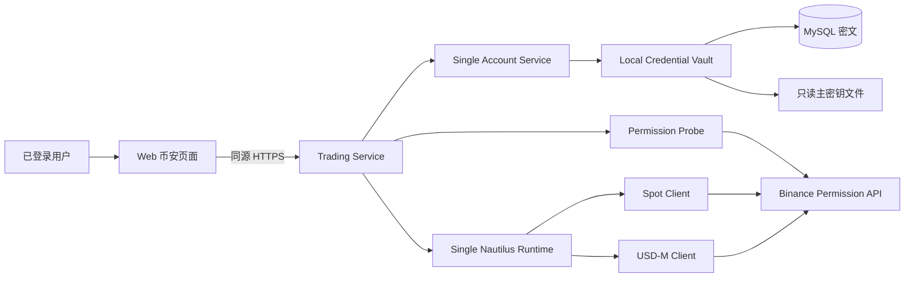
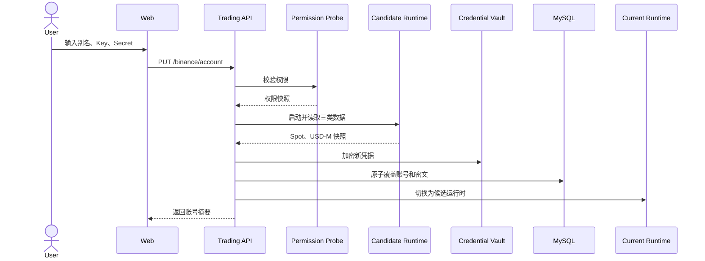

# 币安单账号分阶段接入设计

> 文档编号：QT-DES-BIN-SIMPLE-001
>
> 版本：1.0
>
> 日期：2026-09-21
>
> 状态：已确认

## 1. 决策摘要

系统面向个人 ECS 部署，只允许每个用户绑定一个币安生产账号。重新绑定时覆盖
旧账号，不提供账号列表、激活、停用或切换功能。

功能分两阶段交付：

- 阶段一仅查询账号权限、现货余额、U 本位余额和 U 本位持仓。
- 阶段二增加人工下单、单笔撤单、U 本位杠杆和保证金模式设置。

保留 NautilusTrader 1.231.0 作为币安运行时，Trading Service 内只运行一个
Nautilus `LiveNode`。凭据仅支持 HMAC API Key 和 Secret，使用 ECS 本地主密钥
执行 AES-256-GCM 加密。

首版不建设后台同步、WebSocket 页面推送、资产历史表或多账号状态机。账户数据
按页面请求读取，最多使用 5 秒进程内快照。

本文取代 `QT-DES-BIN-NT-001` 中的当前实现范围。旧文档仅保留为历史记录。

## 2. 设计原则

1. **单账号**：数据库和运行时都只允许一个币安账号。
2. **先读后写**：阶段一不注册任何用户可调用的交易写接口。
3. **同一运行时演进**：阶段二直接扩展现有 Nautilus Runtime，不重新选型。
4. **替换不破坏旧账号**：新凭据完全验证成功后才覆盖旧凭据。
5. **数据按需读取**：余额和持仓不落库，不创建定时同步任务。
6. **单侧可降级**：Spot 或 USD-M 查询失败时，另一侧仍返回可用数据。
7. **写操作可证明一次**：阶段二所有写接口必须使用幂等键。
8. **默认禁止自动交易**：本设计只支持人工发起的交易。

## 3. 功能边界

### 3.1 阶段一：只读

- 绑定或重新绑定一个 HMAC 币安账号。
- 查询 API Key 的读取、现货交易、U 本位交易、提现和划转权限。
- 查询现货非零余额。
- 查询 U 本位余额。
- 查询 U 本位非零持仓。
- 手动刷新当前页面数据。
- 删除已绑定账号。

阶段一明确不提供下单、撤单、杠杆、保证金模式或其他币安写接口。

### 3.2 阶段二：人工交易

- 现货市价单和限价单。
- U 本位市价单和限价单。
- 单笔撤单。
- 按交易对设置 U 本位杠杆。
- 按交易对设置 `cross` 或 `isolated` 保证金模式。
- 持久化平台订单、成交和幂等记录。
- MFA 验证后开启短时交易会话。

### 3.3 非目标

- 多币安账号、账号切换或并行运行。
- Ed25519、RSA 或其他凭据类型。
- 批量撤单、止盈止损和条件单。
- 双向持仓模式。
- 现货杠杆、借款、还款和资产划转。
- 币本位合约、交割合约和期权。
- 自动策略下单。
- 余额和持仓历史分析。
- 浏览器直接访问币安 API。

## 4. 系统架构



系统继续使用现有 Web、Identity、Trading 和 MySQL。币安能力不拆新微服务，不依赖
KMS Adapter、独立 Risk Service、Kafka 或 Redis。

`SingleNautilusRuntime` 在进程内持有唯一账号的 Spot 和 USD-M 客户端。阶段一只
向业务层暴露账户快照读取能力。阶段二才开放执行命令。

Nautilus 未完整暴露 API Key 权限字段，因此权限检查保留一个最小签名 REST
调用，只允许读取 `/sapi/v1/account/apiRestrictions`。该客户端不得包含订单、
撤单或资产划转方法。

## 5. 组件职责

### 5.1 `SingleAccountService`

- 查询当前账号摘要。
- 验证并替换账号。
- 删除账号。
- 保证每个用户最多一条币安账号记录。
- 不暴露明文凭据读取接口。

### 5.2 `LocalCredentialVault`

- 从只读文件加载 32 字节主密钥。
- 使用 AES-256-GCM 加密 API Key 和 Secret。
- 每次加密生成独立 96-bit nonce。
- 使用账号 ID 和版本作为附加认证数据。
- 主密钥文件权限必须为 `600`。

### 5.3 `BinancePermissionProbe`

- 校验 API Key 可读取。
- 校验固定 IP 限制已启用。
- 拒绝开启提现、内部划转或通用划转的 Key。
- 返回现货交易和 U 本位交易权限，供阶段二判断。

### 5.4 `SingleNautilusRuntime`

- 使用唯一账号凭据启动 Spot 和 USD-M 客户端。
- 提供现货余额、U 本位余额和 U 本位持仓快照。
- 分别记录 Spot 和 USD-M 的状态与更新时间。
- 替换账号时先验证候选运行时，再切换正式运行时。
- 阶段二增加订单提交、撤单和 U 本位设置命令。

### 5.5 `BinanceOverviewService`

- 聚合账号摘要、权限和两个产品的账户快照。
- 默认复用最多 5 秒的内存快照。
- `refresh=true` 时绕过内存快照。
- 单侧失败时返回局部错误，不让整个页面失败。

## 6. 账号替换流程



权限检查或候选运行时失败时：

- 不修改数据库中的旧账号。
- 不停止当前运行时。
- 清除请求内存中的新凭据。
- 返回稳定且不含凭据的错误。

删除账号时先停止运行时，再删除账号元数据和密文。

## 7. API 设计

所有路径以 `/api/v1/trading/binance` 开头，并要求登录会话。

### 7.1 阶段一

| 方法 | 路径 | 用途 |
| --- | --- | --- |
| GET | `/account` | 查询账号摘要 |
| PUT | `/account` | 首次绑定或覆盖账号 |
| DELETE | `/account` | 删除账号 |
| GET | `/overview` | 查询权限、现货余额、U 本位余额和持仓 |

绑定请求：

```json
{
  "alias": "主账号",
  "api_key": "write-only",
  "api_secret": "write-only",
  "ip_whitelist_confirmed": true
}
```

账号响应：

```json
{
  "alias": "主账号",
  "api_key_fingerprint": "sha256:abcd1234",
  "connection_status": "connected",
  "last_verified_at": "2026-09-21T08:00:00Z"
}
```

聚合查询：

```text
GET /api/v1/trading/binance/overview
GET /api/v1/trading/binance/overview?refresh=true
```

响应按区域独立表示成功或失败：

```json
{
  "account": {},
  "permissions": {"status": "ok", "data": {}},
  "spot": {"status": "ok", "data": {"balances": []}},
  "usdm": {
    "status": "error",
    "data": null,
    "error": {"code": "binance.usdm_unavailable"}
  },
  "as_of": "2026-09-21T08:00:00Z"
}
```

### 7.2 阶段二

| 方法 | 路径 | 用途 |
| --- | --- | --- |
| GET | `/orders` | 查询平台订单 |
| POST | `/orders` | 提交现货或 U 本位订单 |
| POST | `/orders/{order_id}/cancel` | 单笔撤单 |
| PUT | `/futures/{symbol}/leverage` | 设置 U 本位杠杆 |
| PUT | `/futures/{symbol}/margin-mode` | 设置保证金模式 |

所有阶段二写接口必须携带 `Idempotency-Key`，并要求有效的短时 MFA 交易会话。

下单仅接受：

- `product=spot|usdm_futures`
- `order_type=market|limit`
- `side=buy|sell`
- `time_in_force=GTC`，仅限价单使用

## 8. 数据模型

### 8.1 阶段一

`binance_account` 是逻辑模型；实现复用现有 `trading_accounts` 表，并通过
`tenant_id + provider=binance` 的唯一约束形成单账号槽位，避免新建重复表。

```text
binance_account
id, user_id, alias, api_key_fingerprint, secret_ref,
connection_status, last_verified_at, last_error_code,
created_at, updated_at
UNIQUE(user_id)
```

```text
local_encrypted_secret
id, user_id, ciphertext, nonce, version, created_at, updated_at
```

权限、余额和持仓不落库。权限结果只包含在当前查询响应和最多 5 秒的进程内快照中。

### 8.2 阶段二

```text
binance_order
id, user_id, client_order_id, broker_order_id, product,
instrument_id, side, order_type, time_in_force, quantity, limit_price,
filled_quantity, average_price, status, idempotency_key,
request_fingerprint, error_code, created_at, updated_at
UNIQUE(user_id, idempotency_key)
UNIQUE(user_id, client_order_id)
```

```text
binance_execution
id, user_id, order_id, broker_execution_id, quantity, price,
fee, fee_currency, executed_at
UNIQUE(user_id, broker_execution_id)
```

不创建多账号 Scope、活动账号、余额历史、持仓历史或独立运行时状态表。

## 9. 页面设计

未绑定时：

- 页面主体仅显示“添加账号”。
- 弹窗只包含账号别名、API Key、API Secret 和固定出口 IP 确认。

绑定后：

- 顶部显示账号别名、脱敏 Key、连接状态和最近刷新时间。
- 操作只保留“刷新”“重新绑定”和次要的“删除账号”。
- 内容区显示“现货资产”“U 本位”“API 权限”三个标签。
- U 本位标签同时展示余额摘要和非零持仓表。

阶段二通过功能开关增加“交易”区域。交易未启用时不渲染下单、撤单、杠杆或
保证金模式控件。

## 10. 错误与降级

| 场景 | 错误码 | 行为 |
| --- | --- | --- |
| 未绑定账号 | `binance.account_missing` | 返回 404，引导添加账号 |
| 凭据无效 | `binance.credentials_invalid` | 替换失败，保留旧账号 |
| 固定 IP 未命中 | `binance.ip_not_allowed` | 替换失败，显示 ECS 出口 IP |
| 读取权限缺失 | `binance.read_permission_required` | 替换失败 |
| 提现或划转权限开启 | `binance.unsafe_permissions` | 替换失败 |
| Spot 查询失败 | `binance.spot_unavailable` | USD-M 结果继续返回 |
| USD-M 查询失败 | `binance.usdm_unavailable` | Spot 结果继续返回 |
| 请求限频 | `binance.rate_limited` | 不并发重试，提示稍后刷新 |
| 数据超时 | `binance.query_timeout` | 返回局部错误 |
| Nautilus 未就绪 | `binance.runtime_not_ready` | 查询区域显示未就绪 |
| 写功能未开启 | `binance.trading_disabled` | 阶段一返回 404 或 409 |
| 写结果不确定 | `binance.pending_reconciliation` | 不重发，等待核对 |

错误响应、日志、Trace 和监控标签不得包含 API Key、Secret、密文或 nonce。

## 11. 阶段二安全边界

- 绑定账号不要求 MFA。
- 开启交易会话要求近期 MFA，默认有效期 15 分钟。
- API Key 必须关闭提现和所有划转权限。
- 下单、撤单、杠杆和保证金模式设置都必须带幂等键。
- Nautilus 未连接、账户状态过期或启动对账未完成时拒绝写操作。
- 市价单和限价单必须使用 Nautilus instrument 元数据校验数量、价格和最小名义额。
- 自动策略来源始终拒绝。

## 12. 部署与网络

- Trading Service 使用 `nautilus_trader==1.231.0`。
- 主密钥挂载路径为
  `/opt/quant-trading/secrets/credential-master-key`，权限为 `600`。
- ECS 必须使用固定出口 IP，币安 API Key 必须配置该 IP 白名单。
- ECS 必须能访问 Binance Spot 和 USD-M REST/WebSocket。
- `LIVE_TRADING_ENABLED=false` 时只注册阶段一接口。
- 阶段二启用前必须完成 Testnet 验收，并显式设置
  `LIVE_TRADING_ENABLED=true`。

## 13. 验收标准

阶段一：

1. 一个用户只能保存一个币安账号。
2. 首次绑定后可查询权限、现货余额、U 本位余额和非零持仓。
3. 重新绑定成功后旧密文被删除，新运行时生效。
4. 重新绑定失败时旧账号和旧运行时继续可用。
5. Spot 或 USD-M 单侧失败不影响另一侧展示。
6. 数据库、API、日志和浏览器中不存在明文凭据。

阶段二：

1. Testnet 完成现货和 U 本位市价、限价下单及单笔撤单。
2. 相同幂等键不会重复提交。
3. U 本位杠杆和保证金模式与交易所确认结果一致。
4. 超时结果进入待核对状态，不自动重发。
5. 无 MFA 交易会话、运行时未就绪或自动策略来源时拒绝写操作。

## 14. 历史方案处理

- `QT-DES-BIN-NT-001` 标记为已被本文取代。
- 旧的多账号、Scope、激活/停用、急停和完整风控设计不再作为当前验收依据。
- 已有 AES-GCM、登录、固定出口和 Nautilus 配置代码可以复用。
- 当前自研 Binance 客户端只保留权限探测能力；订单和账户快照逐步迁移到 Nautilus。
