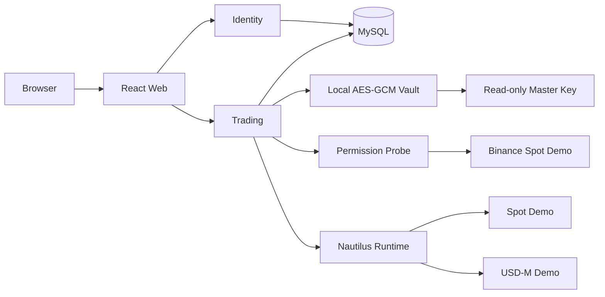

# Binance 单账号分阶段设计

> 状态：已确认
>
> 日期：2026-09-21

## 1. 目标

系统先服务 B Demo：首位所有者登录后绑定唯一模拟账号，查询 Spot 与 USD-M
账户数据，并增加受 MFA 和幂等保护的人工模拟交易。主网接入作为独立后续阶段。

核心原则：

- 生产部署仅允许首位所有者注册，全系统只有一个 Binance HMAC 账号。
- 重新绑定先验证候选账号，成功后覆盖，失败时保留旧账号。
- 凭据只以 AES-256-GCM 密文保存。
- Spot 与 USD-M 独立连接、独立报告故障。
- 当前版本只构造 `BinanceEnvironment.DEMO`，不能通过配置切换主网。

## 2. 系统组成



运行组件只有 Web、Identity、Trading、MySQL 和 Trading 进程内的
NautilusTrader。

## 3. 账号与凭据

绑定表单只接受：

```text
alias
api_key
api_secret
```

安全要求：

- 只支持 HMAC。
- 只接受一套跨产品共享的 Demo API Key；签名校验固定调用
  `https://demo-api.binance.com/api/v3/account`。
- API Key 必须启用读取和交易权限。
- Demo 不启用提现、内部划转和通用划转能力。
- 主密钥为 32 个原始随机字节，宿主机权限 `600`。
- 主密钥只读挂载，不进入 Git、镜像、环境变量或日志。
- API 响应只返回 Key 指纹，不返回凭据或密文。
- 绑定和替换不要求 MFA；删除要求 5 分钟内完成 MFA。

替换顺序：

1. 探测候选 Key 权限。
2. 启动候选 Spot 与 USD-M Runtime。
3. 完成首次账户读取。
4. 写入新密文和账号摘要。
5. 提交数据库事务。
6. 切换 Runtime。
7. 删除旧密文。

任何步骤失败都停止候选 Runtime，并保留旧账号、旧密文和旧 Runtime。
服务重启时从数据库和本地密钥恢复唯一 Runtime；凭据缺失、权限不安全或候选
校验失败会阻止 Trading 就绪，服务关闭时停止 Runtime。

## 4. Demo 连接阶段接口

```text
GET    /api/v1/trading/binance/account
PUT    /api/v1/trading/binance/account
DELETE /api/v1/trading/binance/account
GET    /api/v1/trading/binance/overview
GET    /api/v1/trading/health
GET    /health/binance
```

`overview` 返回：

- 账号摘要与 Key 指纹。
- API 权限。
- 非零 Spot 余额。
- USD-M 余额和非零持仓。

普通请求复用最多 5 秒的内存快照，`refresh=true` 强制刷新。Spot 或 USD-M
单侧失败时，另一侧和权限数据仍返回。

## 5. Demo 交易阶段接口

Demo 交易阶段仅增加：

```text
GET  /api/v1/trading/binance/orders
POST /api/v1/trading/binance/orders
POST /api/v1/trading/binance/orders/{order_id}/cancel
PUT  /api/v1/trading/binance/futures/{symbol}/leverage
PUT  /api/v1/trading/binance/futures/{symbol}/margin-mode
```

范围只包含：

- Spot 与 USD-M。
- 市价单、限价单和单笔撤单。
- USD-M 杠杆和 `cross|isolated` 保证金模式。
- 人工来源。

不包含自动策略、杠杆借还、资产划转、条件单、批量撤单、双向持仓和其他市场。

## 6. 写入门禁

所有 Demo 写入必须同时满足：

- `BINANCE_ENVIRONMENT=demo`。
- `DEMO_TRADING_ENABLED=true`。
- 用户持有未过期的 MFA 交易会话。
- 请求携带 `Idempotency-Key`。
- Runtime 与目标产品已就绪。
- API Key 具备目标产品交易权限。
- 订单参数通过 Nautilus instrument 元数据校验。

明确拒绝保存为 `rejected`。超时或断连保存为
`pending_reconciliation`，禁止自动重发。

## 7. 错误语义

| 场景 | 错误码 |
| --- | --- |
| 未绑定账号 | `binance.account_missing` |
| Runtime 未就绪 | `binance.runtime_not_ready` |
| Spot 不可用 | `binance.spot_unavailable` |
| USD-M 不可用 | `binance.usdm_unavailable` |
| Demo 写入关闭 | `trading.demo_disabled` |
| MFA 缺失或过期 | `auth.mfa_required` |
| 幂等冲突 | `idempotency.conflict` |

错误响应、日志和 Trace 不得包含 Key、Secret、密文或 nonce。

## 8. 发布门禁

Demo 连接阶段必须完成：

1. 单账号约束、加密存储与原子替换。
2. Spot/USD-M 聚合查询和局部降级。
3. Demo-only 部署硬门禁。
4. 模拟账号数据与 Demo 控制台一致。

Demo 交易阶段必须完成 Spot/USD-M 下单、撤单、杠杆、保证金模式、重启恢复和
不确定结果对账。全部通过后再单独设计主网只读验收和实盘灰度；当前版本不存在
主网启用开关。
